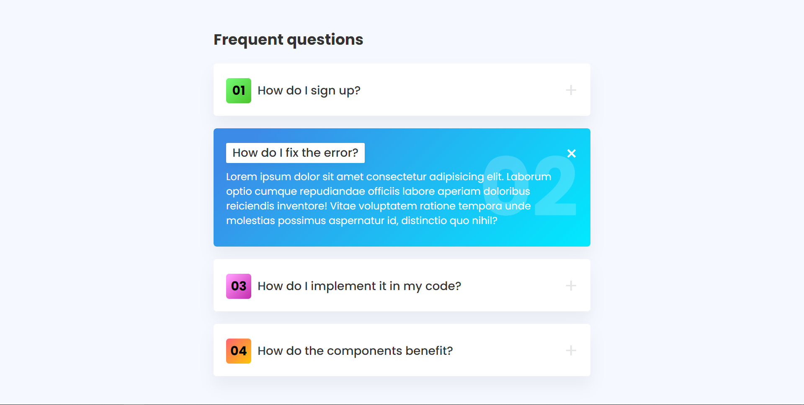

# Expandable Questions Cards

This project is about expandable cards, you can reuse them in your pages by installing it with the code that is here below, it is made with HTML, CSS and Sass
 
# Screen Project  
<div align="center">

</div>


# Install
```sh
git clone https://github.com/asalinasf/expandable-questions-cards/
cd expandable-questions-cards
open in your browse
```

# Visit my project with this url

https://targetas-espandibles-aaron.netlify.app/
